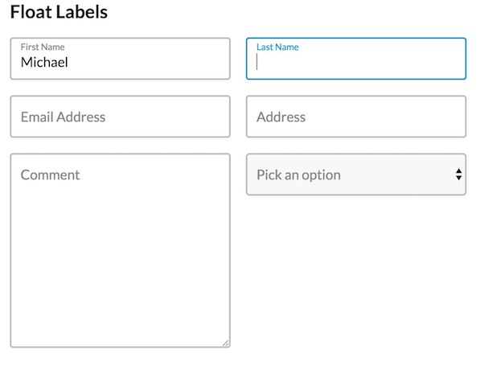

# Mirum Float Labels [](https://travis-ci.org/mturnwall/mirum-float-labels)

This module provides a way to do those fancy form control labels that move out of the way when the form control gets focus.



The module just requires importing the sass and javascript files. The sass file contains some default colors which can be overwritten.

## Installation

Simply use NPM to install the module into your project

```
npm install --save-dev mirum-float-label
```

## Usage

### HTML

The module expects certain HTML. You will need to wrap your form control and label inside a div container. The order of the form control and label doesn't matter since the label is positioned absolutely.

```html
<div class="float-label">
    <input class="float-label__input" type="text" id="fName" placeholder="First Name">
    <label class="float-label__label" for="fName">First Name</label>
</div>

<div class="float-label">
    <input class="float-label__input" type="text" id="lName">
    <label class="float-label__label" for="lName">Last Name</label>
</div>
```

### Sass

If you want to use the default styles as a starting point for your styles just import the sass file.

```scss
@import 'float-label';
```

There a few sass variables that you can update to override with your own styling

* $fl-color-border: #bababa !default;
* $fl-color-error: #f31151 !default;
* $fl-color-label: #868686 !default;
* $fl-color-focus: #0096bd !default;
* $fl-color-background: #fff !default;
* $fl-font-size: 18px !default;

The classes in the sass default to BEM syntax (see HTML example above). If you would like to use different classes in your HTML here are the sass variables to update.

```scss
$fl-has-focus: '&--has-focus';
$fl-has-value: '&--has-value';
$fl-has-error: '&--has-error';
```

Once you have the variables as you want them simply call the mixin inside the selector that you want to use.

```scss
.float-label {
    @include mirum-float-labels();
}
```

### Javascript

This is an ES2015 (ES6) module. So just import it as you need and call the function.

```javascript
import floatLabel from 'float-label';

window.addEventListener('DOMContentLoaded', function () {
    floatLabel();
});
```

#### Browser version

If you are doing a build without using javascript modules there is a browser friendly version of this module that you can use. You can include it into your page with a regular `<script>` tag.

```javascript
<script src="float-label.browser.js"></script>
```

There is also a minified version, `float-label.browser.min.js`,

## License

MIT License

Copyright (c) 2018 Mirum, Inc

Permission is hereby granted, free of charge, to any person obtaining a copy
of this software and associated documentation files (the "Software"), to deal
in the Software without restriction, including without limitation the rights
to use, copy, modify, merge, publish, distribute, sublicense, and/or sell
copies of the Software, and to permit persons to whom the Software is
furnished to do so, subject to the following conditions:

The above copyright notice and this permission notice shall be included in all
copies or substantial portions of the Software.

THE SOFTWARE IS PROVIDED "AS IS", WITHOUT WARRANTY OF ANY KIND, EXPRESS OR
IMPLIED, INCLUDING BUT NOT LIMITED TO THE WARRANTIES OF MERCHANTABILITY,
FITNESS FOR A PARTICULAR PURPOSE AND NONINFRINGEMENT. IN NO EVENT SHALL THE
AUTHORS OR COPYRIGHT HOLDERS BE LIABLE FOR ANY CLAIM, DAMAGES OR OTHER
LIABILITY, WHETHER IN AN ACTION OF CONTRACT, TORT OR OTHERWISE, ARISING FROM,
OUT OF OR IN CONNECTION WITH THE SOFTWARE OR THE USE OR OTHER DEALINGS IN THE
SOFTWARE.

